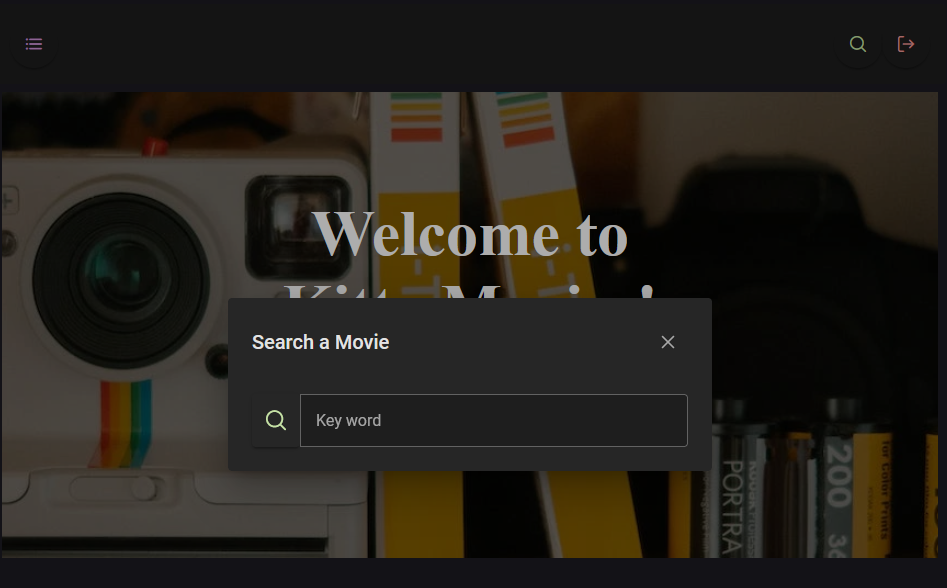

# KittyMovie

<p align="center">
  <a href="https://angular.io/" target="blank"></a>
</p>

# Dev

1. Clone the repository
2. Exec `node init` for download node_modules
3. Change the variables in ```environments.development.ts```
4. Run the project (if you don't have AngularCLI install)

```
   ng serve -o
```

# Preview

## Home Page

This is the Home Page and you can see latest releases movies


and comin' soon movies


in the toolbar you can use the side button and search button.


press the side button to show the side menu


## Information of Movie
If is of interest to you a movie, you can press the button ```info```, and see the movie information in another page and watch Triller, cast, videos, photos, posters and logos of these movie.


## Search
For search, you can press the search button in the side menu or in the 
toolbar too, and using the keyboard enter a word related to a movie you want to search for.



## Used tools

* __Angular__ (Framework v_16.1.0)
* __PrimeNG__
* __PrimeFlex__
* __TMDB__ (API used for movie information)


